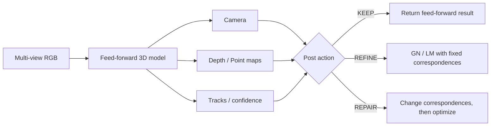

# CV研究者向け E2E multi-view 3D 入門

## 1. 何を入れて、何を出すのか

入力は、同じsceneを異なる位置から撮ったRGB画像の集合です。古典的な pipeline では feature extraction、matching、camera pose estimation、triangulation、bundle adjustment を別々に実行します。VGGT系の E2E model は、これらに相当する量を一つのnetworkから直接出します。

代表的な出力は次の通りです。

- camera extrinsics: 各cameraの位置と向き
- camera intrinsics: focal length、principal pointなど
- depth map: cameraから各pixelまでの奥行き
- point map: 各pixelが対応する3D点
- track / correspondence: 異なるviewのどのpixel同士が同じ3D点か
- confidence: 上記予測の信頼度



## 2. Cameraの最小限

3D点 `X_world` は、外部parameter `(R, t)` と内部parameter `K` を通してpixelへ投影されます。

```text
x_pixel ~ K [R | t] X_world
```

ただし repository ごとに、`[R|t]` が world-to-camera か camera-to-world か、画像のY軸が下向きか上向きか、行vectorか列vectorかが違います。ここを一度間違えると、内部のreprojection errorは小さいのにGT poseとは20度以上ずれる、といった「自己整合している誤り」が起こります。

このため、shape checkだけでなく、実datasetの既知camera・depthで投影を検査する data-grounded convention test が必要です。

## 3. Correspondenceがなぜ重要か

複数viewで同じ3D点を見ているpixel対が分かれば、その3D点とcamera poseを幾何的に拘束できます。逆に、trackが別objectへ飛ぶ、短すぎる、view間でvisibilityが切れる、といった場合は、初期poseが良くてもBAが実行不能または有害になります。

今回の用語では次を区別します。

- `a1`: VGGSfM由来の外部tracker（ALIKED + SuperPoint）
- `a2`: VGGT自身のtrack head
- `oracle`: GT depth / poseから投影した完全対応点。実現可能なtracker性能ではなく、recoverabilityの上限

重要なのは、VGGT論文の `+BA` 設定は `a2` ではなく、外部trackerを使う公開pipelineに対応する点です。「VGGT自身のtrackでBAした結果」と混同してはいけません。

## 4. BA、GN、LM

Bundle Adjustment (BA) は、複数viewのreprojection errorを小さくするように camera pose と3D点を同時に更新する非線形最小二乗です。

- Gauss–Newton (GN): 局所線形化したJacobianから更新量を解く
- Levenberg–Marquardt (LM): dampingを入れて不安定な更新を抑える
- robust loss: outlier correspondenceの影響を弱める

「networkが6D pose deltaを直接回帰する」ことと、「networkが重みやdampingを予測し、真の投影JacobianでGN/LM更新を計算する」ことは別です。後者は、更新が明示的なgeometric energyに対応するため、descentやtrust-region acceptanceを実装と一致した形で検査できます。

## 5. KEEP / REFINE / REPAIR

- `KEEP`: feed-forward出力をそのまま返す。失敗時fallbackではなく一つのaction
- `REFINE`: correspondenceを固定したまま pose / point を最適化する
- `REPAIR`: correspondence自体を再割当・追加・棄却してから最適化する

今回のoracle action ceilingでは、24系列中21系列でREPAIRが最良、3系列でREFINE、KEEPは0でした。これは完全対応点を使った上限なので、現実のrepairが同じgainを出すという意味ではありません。ただし「どこにmethod価値が集中しているか」を切り分ける強い診断です。

## 6. Gaugeと評価

multi-view reconstructionは、世界座標全体を回転・並進・scale変更しても同じ画像を説明できる場合があります。これを gauge freedom と呼びます。絶対座標を直接比較すると、正しいreconstructionを誤判定し得ます。

今回のpose評価は、pairwise relative rotation / translation を使う gauge-free な AUC@30 を主に用いました。

| metric | 意味 | 良い方向 |
|---|---|---|
| Pose AUC@30 | relative pose error threshold 0–30°の成功率曲線下面積 | 高い |
| Depth AbsRel | `mean(|d_pred-d_gt|/d_gt)` | 低い |
| Depth Delta1 | depth ratioが1.25以内のpixel割合 | 高い |
| refusal rate | 事前定義したhealth gateを通らず、optimization結果を採用できない割合 | 低い |

`refusal` は「数値発散」と同義ではありません。pre-BAで条件不足、実行後residualが不健全、objective増加などを分けて記録します。utilityを評価するときは、refusalしたarmをcomplete-caseから落とさず、`KEEP=FF` として扱うのが自然です。

## 7. モデルの位置づけ

| model | 基本形 | 今回の扱い |
|---|---|---|
| VGGT | 大規模feed-forward model。camera、depth、point、trackを予測 | differentialの主対象 |
| Déjà View / DVLT | weight-tied blockをK回適用するlooped transformer | K sweepを第三者再現 |
| π³ | reference viewを固定しないpermutation-equivariant feed-forward model | adapterのみ。比較結果は未取得 |
| MapAnything | 画像と任意の幾何入力を統合するmetric feed-forward model | 設計対象のみ。比較結果は未取得 |

## 8. 初見で特に危ない誤解

1. 反復を増やせば必ず改善する、とは限らない。
2. 良いfeed-forward poseがあればBAも成功する、とは限らない。
3. BAのrefusalをsolver divergenceと呼んではいけない。
4. repeated kernel / jitter / frame設定を独立scene数に数えてはいけない。
5. 内部reprojectionが小さいだけではcamera conventionの正しさを証明できない。
6. 「入力trackに反応する」ことは「正しいgeometric updateを出す」ことを意味しない。
