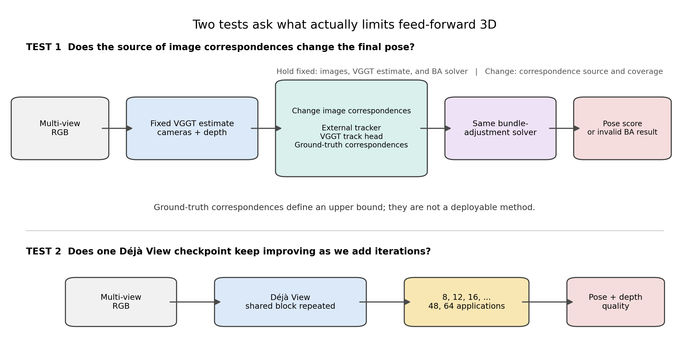
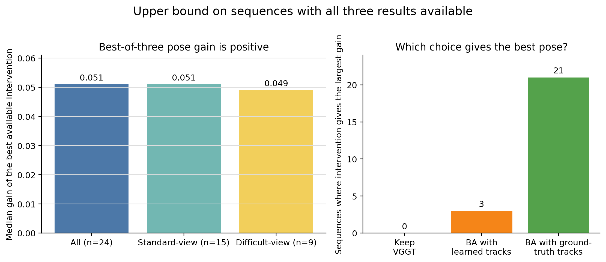
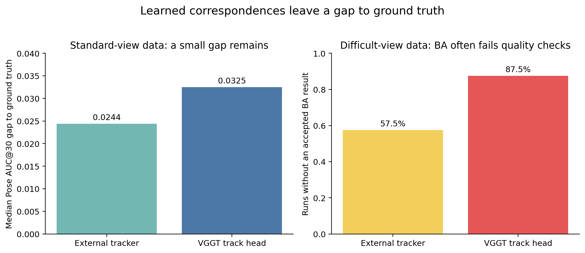
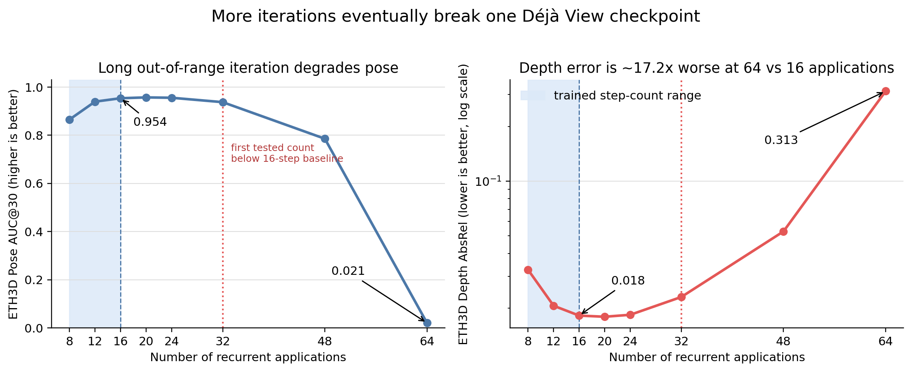

# VGGTの精度をさらに上げるには，何を改善すべきか

- 実験日: 2026-07-10
- 最終更新: 2026-07-15
- 対象: VGGTの対応点診断，Déjà Viewの反復回数検証，対応点を使う学習器の失敗分析

## 要約

[VGGT](https://arxiv.org/abs/2503.11651)は，複数画像からカメラ姿勢，奥行き，3D点を一度のニューラルネットワーク推論で求める．VGGT論文では，この出力にbundle adjustmentを加えるとカメラ姿勢の精度がさらに上がる．しかし，論文の結果だけでは，VGGTが最初に出す姿勢，bundle adjustmentへ渡す対応点，最適化のどれが改善を生んだかは分からない．

そこで，VGGTの初期出力とbundle adjustmentを固定し，対応点の作り方だけを変えた．三種類の結果が揃った24系列では，正解情報から作った対応点を使う処理が21系列で最良であった．姿勢推定モデルを変えなくても，対応点側に改善余地が残っていたことになる．ただし，これは実際には使えない正解対応点と事後的な最良選択を使った上限であり，実用手法の性能ではない．

別の実験では，[Déjà View](https://arxiv.org/abs/2605.30215)の反復回数だけを増やした．学習範囲の近くでは性能がほぼ変わらなかったが，64回反復では奥行き誤差が16回時の約17.2倍になり，姿勢精度も大きく崩れた．一つの公開モデルに対する結果ではあるが，学習範囲を少し超えるだけの試験では，長い反復で起きる問題を見逃すことが分かった．



*図1．上段では，入力画像，VGGTの初期出力，bundle adjustmentの実装を固定し，対応点の作り方だけを変えた．下段では，Déjà Viewに同じ入力を与え，反復回数だけを変えた．*

## 1．背景

### 1.1 Feed-forward 3Dとは何か

従来のmulti-view 3D reconstructionは，画像間の対応点を求め，カメラ姿勢を推定し，3D点を復元し，最後にbundle adjustmentで全体を調整する．場面ごとに複数の処理を順番に実行する構成である．

VGGTは，この流れの多くを一つのニューラルネットワークへまとめる．同じ場面を撮影した画像群を入力すると，各画像のカメラ姿勢，奥行き，3D点，画像間のpoint trackを一度の推論で出力する．このように，場面ごとの反復最適化を行わずに結果を出す方法をfeed-forward 3Dと呼ぶ．

### 1.2 なぜbundle adjustmentを調べるのか

VGGT論文では，一回の推論だけでも高い姿勢精度が得られるが，その出力へbundle adjustmentを加えると，RealEstate10Kの姿勢スコアが85.3から93.5へ，CO3Dv2では88.2から91.8へ上がる．

Bundle adjustmentは，複数画像に写る同じ3D点を手掛かりに，カメラ姿勢と3D点を同時に調整する．例えば，画像Aの机の角と画像Bの同じ机の角を対応づけ，推定した3D点を各画像へ投影した位置が実際の画素位置に近づくように最適化する．

この処理には，少なくとも次の二つが必要である．

1. 調整を始めるためのカメラ姿勢と3D点
2. 複数画像で同じ3D点を示す対応点

Bundle adjustmentは，与えられた対応点を使ってカメラと3D点を動かす．別の物体同士を結んだ誤対応を，自動的に正しい対応へ置き換える処理ではない．したがって，VGGTを改善するには，初期姿勢を直すべきか，対応点を直すべきかを分けて調べる必要がある．

### 1.3 今回の仮説

実験前には，次の四つを仮説として置いた．

1. 対応点が主な制約なら，VGGTの初期出力とbundle adjustmentを固定し，対応点だけを正解に近づけても姿勢精度が上がる．
2. 視点差が大きい画像でbundle adjustmentが使えない主因が初期姿勢なら，初期姿勢が悪い系列ほど失敗しやすい．
3. Déjà Viewの反復が安定した更新を学んでいるなら，推論時に反復を増やしても急激には崩れない．
4. 学習器が対応点を使って姿勢を改善できるなら，初期出力を固定して対応点だけを変えたときに出力が変わり，その結果として姿勢精度も上がる．

第一，第三，第四の仮説は今回の結果から検討できた．第二の仮説は，必要な値を同じ画像系列ごとに保存していなかったため，検証できなかった．

## 2．実験設計

### 2.1 対応点の作り方だけを変える

入力画像，VGGT-1Bが出力したカメラ姿勢と奥行き，bundle adjustmentの実装，評価指標を固定した．変えたのは，画像間の対応点をどこから得るかだけである．

- **外部モデルの対応点**: 画像特徴の検出と追跡を専門に行う別のモデルを使う．VGGT公式のbundle-adjustment経路と同じ系統である．
- **VGGT自身のpoint track**: VGGTが出力する，同じ点を複数画像で追跡した座標列を使う．
- **正解対応点**: 正解カメラと正解奥行きを使い，同じ3D点が別画像のどこへ写るかを計算する．

正解対応点は実際の推論では使えない．現在の初期出力とbundle adjustmentを変えずに，対応点だけが理想的ならどこまで改善できるかを測るための上限である．ただし，この対応点は正しさだけでなく，点の数，画像内の分布，画像間の接続も推定対応点と異なる．そのため，今回の実験は「誤対応だけ」の影響ではなく，対応点生成全体の差を測っている．

### 2.2 評価データ

評価単位は，ひとまとまりの画像系列である．同じ系列に対して最適化設定や入力枚数を変えた試行は，別の系列として数えていない．

| 撮影条件 | データセット | 系列数 | 主な特徴 |
|---|---|---:|---|
| 標準的な画像 | CO3D，Replica | 15 | 物体中心または屋内の場面 |
| 視点差が大きい画像 | ETH3D，TartanAir | 14 | 画像間の対応点を求めにくい |

全29系列のうち，三種類の処理結果を同じ系列上で比較できたのは24系列である．残りの系列を除いた24系列の結果は，実運用時の平均性能ではなく，比較可能な系列における診断上限として扱う．

### 2.3 評価指標

カメラ姿勢にはPose AUC@30を用いた．複数の画像対について，回転と並進方向の誤差が30度以内に収まる割合を曲線として集計した指標であり，0から1の範囲で高いほどよい．

Déjà Viewの奥行きにはAbsRelを用いた．推定奥行きと正解奥行きの相対誤差を平均した指標であり，低いほどよい．

Bundle adjustmentの前後には品質検査を置いた．必要な対応点数を満たさない場合，または最適化後の再投影誤差が大きい場合は，その最適化結果を採用しなかった．したがって，「採用できなかった試行」には，数値計算の発散だけでなく，対応点不足と品質検査による中止も含まれる．

### 2.4 Déjà Viewの反復回数を変える

Déjà Viewは，同じTransformer blockを繰り返して3D推定を更新する．公開モデルは8回から16回の反復で学習されている．同じETH3D 13系列に対して，反復回数を8，12，16，20，24，32，48，64回へ変えた．

17回以上では，同じblockを学習時より多く繰り返す．新しい17段目以降のlayerが存在するわけではない．この実験は，論文が報告した学習範囲内の性能を再検証するものではなく，公開モデルを範囲外まで反復したときの挙動を調べるものである．

## 3．実行設定

### 3.1 VGGT

| 項目 | 設定 |
|---|---|
| 使用モデル | `facebook/VGGT-1B` |
| 画像解像度 | 読み込み時の最大辺1024 px，モデル入力518 px |
| 対応点 | 最大4096点，対応点検索の基準画像8枚，可視性スコア0.2以上 |
| カメラ表現 | OpenCVのworld-to-camera，PINHOLE，内部パラメータ固定 |
| 外れ値に強い誤差関数 | soft-L1，scale 4 px |
| 対応点の採用条件 | 初期再投影誤差12 px以下，2画像以上で追跡，1画像あたり16点以上 |
| Bundle adjustment | 最大80回，停止判定1e-10 |

### 3.2 Déjà View

公開された1.17億パラメータの`nvidia/dvlt`モデルと公式評価コードを用いた．実行環境はPython 3.12，PyTorch 2.5.1，CUDA 12.4，ABCIのGPU 1基である．反復中の内部状態を記録する処理について，16回反復時に記録の有無で出力差が0であることを確認した．

## 4．結果とQ&A

### Q1．対応点の作り方を変えるだけで，VGGTの姿勢推定はさらに良くなるか

**A．良くなる余地があった．比較可能な24系列のうち21系列で，正解対応点を使った処理が最良であった．**

三種類の結果が揃った24系列について，次の三つからPose AUC@30が最も高い処理を系列ごとに選んだ．

1. 元のVGGT出力をそのまま使う
2. 推定対応点でbundle adjustmentを行う
3. 正解対応点でbundle adjustmentを行う

| 撮影条件 | 系列数 | 改善量の中央値 | 改善した系列 | 最良だった処理 |
|---|---:|---:|---:|---|
| 全体 | 24 | +0.051 | 24/24 | 正解対応点 21，推定対応点 3，元出力 0 |
| 標準的な画像 | 15 | +0.051 | 15/15 | 正解対応点 14，推定対応点 1，元出力 0 |
| 視点差が大きい画像 | 9 | +0.049 | 9/9 | 正解対応点 7，推定対応点 2，元出力 0 |



*図2．三つの結果が揃った24系列で，結果を見た後に最良の処理を選んだ場合の上限である．左は元のVGGT出力からの改善量，右は最良だった処理の内訳を示す．*

24系列すべてで，元のVGGT出力より良い選択肢が存在した．正解対応点を使う処理が最良だった系列が最も多かったことから，対応点生成は有力な改善対象である．ただし，正解対応点と事後的な最良選択を使っているため，実際の対応点推定法が同じ改善を得られるとは限らない．

### Q2．標準的な画像でも，推定した対応点と正解対応点に差はあるか

**A．差はあったが，小さかった．**

正解対応点を使った結果は，外部モデルの対応点を使った結果より，評価可能な14系列中13系列で良かった．Pose AUC@30の差の中央値は0.0244であった．VGGT自身のpoint trackと比べた場合は15系列すべてで良く，差の中央値は0.0325であった．

この結果は，標準的な画像でも差が完全には消えないことを示す．ただし，0.02から0.03程度の差であり，大幅な改善を示す結果ではない．また，二つの比較では評価できた系列数が異なるため，外部モデルとVGGT自身のpoint trackを厳密に順位づけることはできない．

### Q3．VGGT単体の姿勢精度が高ければ，bundle adjustmentも安定して使えるか

**A．今回の記録だけでは判断できない．両者を同じ画像系列ごとに結び付けて保存していなかったためである．**

視点差が大きい画像系列では，VGGT単体のPose AUC@30中央値は0.933であった．一方，外部モデルの対応点を使った試行の57.5%，VGGT自身のpoint trackを使った試行の87.5%では，対応点数や再投影誤差の基準を満たさず，bundle adjustmentの結果を最終出力として採用できなかった．



*図3．左は標準的な画像で正解対応点との差を測った結果，右は視点差が大きい画像でbundle adjustmentの結果を採用できなかった試行の割合である．左右は集計単位が異なるため，直接対応づけることはできない．*

0.933は画像系列ごとに集計した姿勢精度であり，57.5%と87.5%は設定を変えた個々の試行に対する割合である．したがって，「高い姿勢精度だった同じ系列でbundle adjustmentが失敗した」とは言えない．今回の記録から得た教訓は，姿勢精度，対応点数，再投影誤差，bundle adjustmentの成否を同じ系列と試行の単位で保存しなければ，失敗原因を検証できないことである．

### Q4．Déjà Viewは，推論時の反復を増やすほど正確になるか

**A．増やし続ければよいわけではない．20回と24回では安定して見えたが，64回では姿勢と奥行きの両方が大きく崩れた．**

| 反復回数 | Pose AUC@30 ↑ | Depth AbsRel ↓ | Depth Delta1 ↑ |
|---:|---:|---:|---:|
| 8 | 0.865 | 0.0325 | 0.986 |
| 12 | 0.940 | 0.0206 | 0.997 |
| 16 | 0.954 | 0.0182 | 0.997 |
| 20 | 0.957 | 0.0180 | 0.997 |
| 24 | 0.956 | 0.0184 | 0.997 |
| 32 | 0.938 | 0.0231 | 0.996 |
| 48 | 0.786 | 0.0529 | 0.980 |
| 64 | 0.021 | 0.3126 | 0.484 |



*図4．同じ公開モデルとETH3D 13系列に対し，反復回数だけを変えた結果である．青い領域が学習時の反復範囲を示す．姿勢は高いほど，奥行き誤差は低いほどよい．*

16回から24回までは，姿勢と奥行きの指標がほぼ同じ水準にあった．統計的不確実性を評価していないため，この小さな差を改善とは扱わない．32回から16回時の性能を下回り，64回ではPose AUC@30が0.954から0.021へ低下した．AbsRelは0.0182から0.3126へ増え，約17.2倍になった．

意外だったのは，20回や24回では明確な破綻が見えなかった点である．学習範囲を少し超えた試験だけでは，長い反復で起きる問題を見逃す．ただし，この結果は一つの公開モデルとETH3D 13系列に限られ，反復型モデル全般の発散を示すものではない．

<details>
<summary>内部状態の補助診断</summary>

学習範囲内では，隣り合う反復の84.1%で内部状態の大きさが減らなかった．一方，最初から最後まで単調に増え続けた系列はなかった．また，768 channels中567 channelsが，「学習範囲内の最大値を超え，範囲外の後半でも増加傾向を持つ」という有限長の診断条件を満たした．これは64回までの挙動を説明する補助情報であり，無限回反復したときの発散証明ではない．

</details>

### Q5．対応点を入力する学習器を作れば，カメラ姿勢を改善できるか

**A．今回試した学習器では改善できなかった．対応点の違いに反応するだけでは，正しい姿勢補正を求められなかった．**

正解対応点を使わずに姿勢を改善するため，VGGTの初期出力と対応点から姿勢の補正量を予測する小さなニューラルネットワークを試した．

最初のモデルは，対応点を消したり入れ替えたりしても出力がほとんど変わらなかった．実質的にVGGTの初期出力だけを見ており，ETH3Dでは元の良い姿勢を悪化させた．

次に，改善が期待できない場合は姿勢を変えない仕組みを加えた．悪化は減ったが，同じ場面の正しい対応点と壊した対応点を対にした学習データがなく，対応点の違いを学習できなかった．

最後に，正しい対応点と意図的に壊した対応点を対にして学習した．対応点を変えると出力も変わるようになったが，姿勢精度は改善しなかった．教師として与えた姿勢更新が，実際の投影誤差を下げる幾何計算ではなく，平均残差から作った近似的な更新だったためである可能性がある．

この結果は，対応点を入力へ加えるだけでは不十分であり，「対応点を使っているか」と「幾何学的に正しい方向へ更新しているか」を別々に検証する必要があることを示す．ただし，この試行の定量的な再現データはリポジトリに残っていないため，うまくいかなかった試行から得た設計上の知見として扱う．

## 5．何が予想外で，なぜ重要か

### 5.1 姿勢推定モデルを変えなくても，対応点だけで改善余地が現れた

VGGTの姿勢精度を上げるなら，姿勢を予測する部分やbundle adjustmentそのものを改良する必要があると考えやすい．しかし，今回の上限診断では，それらを固定して対応点だけを正解情報に置き換えた処理が24系列中21系列で最良であった．少なくとも次の研究候補として，対応点生成は姿勢推定モデルの大型化と同じように検討する価値がある．

ただし，正解対応点は点の数と分布も変える．今回切り分けられたのは「初期出力とbundle adjustment」対「対応点生成全体」であり，誤対応だけの効果ではない．

### 5.2 本来の仮説を，保存データから検証できなかった

視点差が大きい画像では，VGGT単体の姿勢精度が高いという集計と，bundle adjustmentの結果を採用できない試行が多いという集計が得られた．しかし，一方は画像系列単位，もう一方は試行単位であり，同じ系列上で対応づけられなかった．

このため，「初期姿勢が悪いからbundle adjustmentが失敗したのか」という本来の問いには答えられない．結果の保存単位は後処理では直せない．今後は，姿勢精度，対応点数，再投影誤差，最適化の成否を同じ系列と試行の識別子で保存する必要がある．

### 5.3 学習範囲のすぐ外側だけを見ても，長い反復の崩壊は分からなかった

Déjà Viewは20回と24回では16回時とほぼ同じ性能だったが，64回で大きく崩れた．反復回数を推論時に変えられるモデルでは，学習上限を少し超えた地点だけでなく，実際に使う最大回数まで評価しなければならない．

### 5.4 対応点への反応と，正しい姿勢補正は別であった

正しい対応点と壊した対応点を対にすると，学習器は対応点の違いに反応するようになった．それでも姿勢精度は改善しなかった．入力を使っていることの確認だけでは足りず，その出力が投影誤差を下げる方向かを別に検査する必要がある．

## 6．次に確かめること

### 6.1 対応点の何が効いたかを切り分ける

点の数，画像内の位置，画像間の接続を揃えたまま，対応が正しいかどうかだけを変える．これにより，今回の差が誤対応，点の不足，画像内の偏りのどれから生じたかを切り分ける．

### 6.2 失敗時に元の出力へ戻す規則を含めて評価する

Bundle adjustmentの結果を採用できなかった場合は，元のVGGT出力を返す．この規則を含む最終結果を29系列すべてで評価する．今回の24系列の値は改善可能性の上限であり，実運用時の性能ではない．

### 6.3 初期姿勢と最適化の失敗を同じ単位で保存する

姿勢精度，対応点数，再投影誤差，bundle adjustmentの成否を，同じ画像系列と試行の単位で保存する．これにより，「初期姿勢が悪いから失敗した」という仮説を直接検証できる．

### 6.4 次の手法案

すべての場面へ同じ姿勢補正を適用するのではなく，元のVGGT出力を返す，既存の対応点でbundle adjustmentを行う，対応点を作り直してからbundle adjustmentを行う，という処理を場面ごとに選ぶ構成を候補とする．

また，学習器に姿勢補正を直接出させる代わりに，対応点の信頼度や外れ値の重みを予測させ，実際の姿勢更新は投影モデルに基づくGauss-NewtonまたはLevenberg-Marquardtで計算する構成も候補である．どちらも今回の結果から導いた次の仮説であり，性能はまだ検証していない．

## 7．限界

- 初期値について測ったのはカメラ姿勢であり，奥行きと3D点を含む初期3D推定全体の品質ではない．
- 視点差が大きい画像の初期姿勢は系列単位，bundle adjustmentの結果を採用できなかった割合は試行単位であり，系列ごとの関係を検証できない．
- 正解対応点は，対応の正しさだけでなく，点の数，分布，画像間の接続も変える．
- Bundle adjustmentの種類，反復上限，dampingを比較していないため，別の最適化設定で差が縮むかは未検証である．
- 三処理を比較できたのは29系列中24系列であり，実運用の平均性能ではない．
- 標準的な画像での差は主にCO3Dの観測に基づく．別のデータセットで同じ差が出るとは限らない．
- π³とMapAnythingでは同じ診断を完了していない．
- Déjà Viewの17回以上は学習範囲外であり，一つの公開モデルとETH3D 13系列に対する結果である．
- 対応点を使う学習器の定量的な再現データは残っていない．

## 8．監査で訂正した点

### 設定違いの試行を独立した系列として数えない

初期集計では，誤差関数，初期値の微小な変更，入力枚数の違いを別の画像系列として数え，510試行を独立観測のように扱っていた．同じ画像系列の反復測定なので，現在は系列内で先に集約し，その後に系列間の値を計算している．

### 姿勢を補正する学習器の収束保証を撤回する

初期の学習器では，別の最適化法に対する条件を今回の更新にも適用し，収束保証があると報告していた．実装した更新にはその保証を適用できないため，この主張を撤回した．

### 二種類の対応点に対する値を混ぜない

87.5%はVGGT自身のpoint track，57.5%は外部モデルの対応点を使った試行の値である．一つの割合として扱わない．

### 成功した系列だけを実運用性能と呼ばない

Bundle adjustmentが成功した系列だけで平均を取ると，処理しやすい系列だけが残る．24系列の結果は診断上限として扱い，実運用性能を評価するときは，失敗時に元のVGGT出力を返した結果も含める必要がある．

## 9．再現できる範囲

保存済みの集計データから，本文の主要数値と図は再生成できる．

```bash
pip install -r requirements.txt
make check
```

`make check`は，保存データ，本文で使う集計値，生成された図の整合性を検査する．モデル推論やbundle adjustmentを再実行するものではない．

- [Déjà Viewの集計データ](../data/raw/dvlt_r1_r2_r3_summary.json)
- [VGGTの系列単位集計](../data/t36_sequence_summary.json)
- [図生成スクリプト](../scripts/make_figures.py)

一方，Déjà View実行時に使った上流コードと公開モデルの版，設定の完全な記録が残っていない．VGGT診断も，一部の実行出力と系列ごとの試行記録が残っていない．このリポジトリだけから全実験を再実行することはできない．

## 10．一次資料

- [VGGT paper](https://arxiv.org/abs/2503.11651)
- [VGGT official code](https://github.com/facebookresearch/vggt)
- [Déjà View paper](https://arxiv.org/abs/2605.30215)
- [Déjà View official code](https://github.com/nv-tlabs/dvlt)
- [Déjà View公開モデル](https://huggingface.co/nvidia/dvlt)
