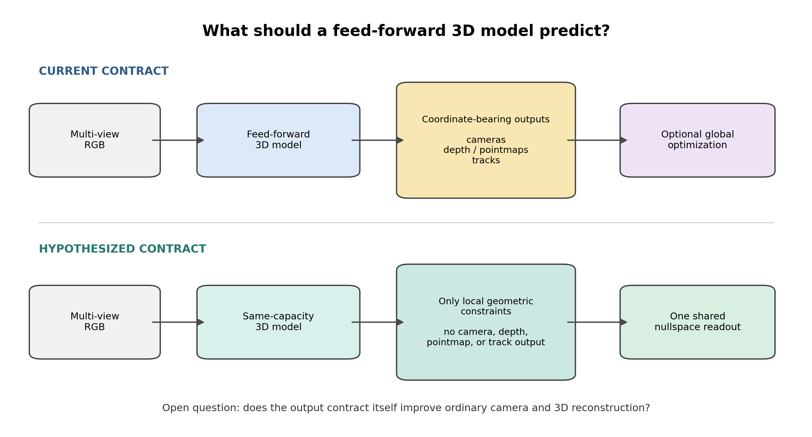
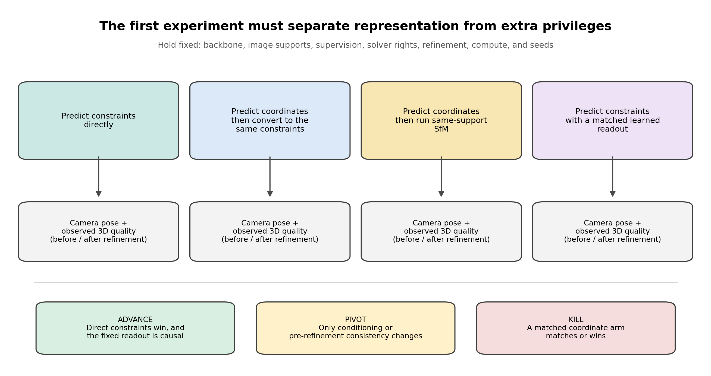

# 座標ではなく「幾何を満たす関係式」を予測する feed-forward 3D は有利か

- 調査日: 2026-07-15
- 状態: 仮説と実験計画．学習・評価は未実施
- 対象: VGGT，π³，MapAnythingに代表されるfeed-forward multi-view 3Dの出力形式

## 先に結論

今回得られたのは新しい実験結果ではなく，次に検証する価値が残った一つの仮説である．

VGGTのようなfeed-forward 3Dは，複数画像からカメラ姿勢，奥行き，pointmap，対応点などを直接予測する．今回の仮説は，これらの座標を直接予測せず，「同じ3D形状なら満たすべき局所的な関係式」だけを予測し，すべてのカメラと観測された3D点を一つの共通解として復元するというものである．

ただし，ここに情報量の優位性はない．局所座標が分かれば，同じ関係式を決定的に作れるからである．したがって，「関係式の方が座標より多くの情報を持つ」「global solverを使うから良い」という主張は成立しない．残る可能性は，関係式だけを出力させる制約が学習時の無駄な自由度を減らし，複数画像の整合性を取りやすくするという，出力形式が学習へ与える構造的な偏りだけである．

この点が今回の自明でない部分である．関係式を直接予測する手法と，座標を予測してからまったく同じ関係式へ変換する手法を，同じbackbone，同じ対応関係，同じsolver，同じ計算量で比較しなければ，仮説そのものを検証できない．この強い比較対象が同等以上なら，手法としての主張は消える．

先行研究の調査では，局所的なoperatorを予測してglobal solveする一般形，feed-forward 3Dの出力をglobal SfMやbundle adjustmentへ渡す一般形，二画像間の幾何制約を予測する一般形は既に存在した．一方，複数画像から座標を一切出力せず，一つの関係式の集合だけからcameraと3D点を同時に復元する構成は見つからなかった．これは新規性の証明ではなく，現時点の調査範囲では同一構成の先行研究を確認できなかったという意味である．

現時点では学習も評価も行っていない．本レポートでは，この仮説を検証するために必要な比較条件と，支持・棄却・保留を分ける判定基準までを記録する．

## 1．何が問題なのか

VGGTは，一つまたは複数の画像からカメラ，奥行き，3D点，point trackを直接予測する．π³は固定した基準画像に依存しないcamera poseとlocal pointmapを予測し，MapAnythingも複数の3D taskを一つのfeed-forward modelで扱う．これらの方法が変えたのは，従来のSfMが対応点探索，camera estimation，triangulation，bundle adjustmentを順番に実行していた処理を，大きなニューラルネットワークで直接予測できるようにした点である．

直接予測には明確な利点がある．処理が速く，画像間の対応が難しい場面でも，学習したpriorを使ってカメラと3D形状を出せる．一方，camera pose，depth，pointmap，trackを別々の出力として持つと，それぞれが同じ3D世界を表していることをlossや後処理で整合させる必要がある．

ここで生じる疑問は，「feed-forward 3Dの後ろへ最適化を追加すべきか」ではない．GLUEMAPやGlob3Rは，feed-forward modelが出したdepth，pose，pointmap，warp，trackをglobal SfMやbundle adjustmentへ渡す構成を既に示している．今回の問いは，ニューラルネットワークが最初から何を出力すべきかである．座標を出してから整合させる代わりに，整合した3D世界が満たす関係だけを出力させる方が，学習問題として有利かを調べる．

## 2．提案している出力形式

*図1．上段はcamera，depth，pointmap，trackのような座標を直接出す現在の構成である．下段は局所的な幾何関係だけを出し，全体を一つのnullspaceから復元する仮説である．*

局所的な関係式は，近くにある少数のカメラ中心や観測点へ符号付きの重みを付け，整合した3D配置ではその重み付き和がゼロになるように作る．一つの関係式だけでは3D形状は決まらない．画像全体から多数の関係式を集めると，すべてを同時に満たす共通の解空間が得られる．

この解空間のうち，三つの方向が3D座標に対応し，残る一つがすべての点に共通する定数成分に対応する．そのため，理想的な条件では四次元のnullspaceからcamera centerと観測された3D点を同時に復元できる．最後に，既知のcamera calibration，正しい向き，奥行きの正負を固定した手順で決める．

重要なのは，ニューラルネットワークがcamera，depth，pointmap，ray，track coordinateを別の出力として渡さないことである．それらを残すと，関係式が本当に結果を決めたのか，別の出力が結果を運んだのかを区別できない．

## 3．なぜ効く可能性があるのか

### 3.1 座標系の選び方を学習器へ背負わせない

同じ3D形状でも，平行移動，回転，scale，より一般にはaffine transformationによって座標値は変わる．座標を直接出すmodelは，学習時にどの座標系を選ぶかまで決める必要がある．関係式は，このような座標系の違いに対して同じ意味を保てる．そのため，学習器が本質的でない自由度へcapacityを使う量を減らせる可能性がある．

### 3.2 すべてのcameraと3D点が一つの解を共有する

cameraごと，pixelごとに座標を独立にdecodeした後で整合させるのではなく，最初から全cameraと全3D点を一つのglobal solveで復元する．個々の予測が局所的に正しくても全体として矛盾する，という失敗を減らせる可能性がある．

### 3.3 solverの形を固定できる

関係式からnullspaceを求める部分は既知の線形代数で実装できる．学習器が最終座標を自由にdecodeする場合と比べ，どの計算が最終結果を決めるかを明確にできる．ただし，固定solver自体は新しくなく，固定solverを使うだけで精度が上がるとも限らない．

## 4．なぜ効かない可能性が高いのか

### 4.1 座標の単なる書き換えかもしれない

少数の点の局所座標が分かれば，対応する関係式は一意に計算できる．逆に，正規化した関係式から局所座標を復元できる条件も多い．したがって，両者はほぼ同じ情報を別の書き方で表している．最も強い反証は，同じ情報量の座標を予測して関係式へ変換した比較対象が，同じ精度を出すことである．

### 4.2 誤った関係式でもglobalに整合してしまう

nullspace solverが判定できるのは，入力された関係式が互いに整合しているかである．その関係式が実画像の同じ物体や同じ点を結んでいるかまでは判定できない．繰り返し模様や似た建物を一貫して誤対応すると，間違っていても代数的にはきれいな解が得られる．

### 4.3 画像枚数とシーンの広がりにより数値的に不安定になる

画像間の重なりが弱い，sceneが長い，接続が細いという条件では，nullspaceとそれ以外の成分の分離が小さくなり，局所的な予測誤差が全体へ増幅される可能性がある．座標を直接使う方法より不安定になることも十分に考えられる．

### 4.4 対応関係の選択自体が3D情報を運ぶ可能性がある

どのcameraやscene pointを一つの関係式へ含めるかを学習器が自由に選ぶと，その組み合わせ自体が大きな情報を運べる．関係式の係数だけを比較しても，実際には対応関係を選ぶ部分が3Dを解いているかもしれない．最初の比較では，すべての手法へまったく同じ対応関係を与える必要がある．

## 5．先行研究との境界

| 研究の系統 | 既に示されていること | 今回との違い |
|---|---|---|
| Neural Jacobian Fields | 局所的なJacobianを予測し，標準Poisson solveでglobal mapを復元する | 入力はmeshであり，multi-view RGBからcameraとscene 3Dを一つのnullspaceとして復元する問題ではない |
| GLUEMAP | Feed-forward modelのdepth，camera，trackをglobal motion averagingとbundle adjustmentへ渡す | 座標を持つ出力が明示的にsolverへ入る |
| Glob3R | 3D foundation modelのlocal geometryとdense warpからtrackを作り，global SfMを行う | local geometryとwarpが明示的な中間表現である |
| DROID-SLAM，BA-Net，DeepV2Dなど | 学習した対応，flow，depth，pose，residualをfactor graphやbundle adjustmentで解く | 状態変数や座標を持つmeasurementを反復最適化する |
| Fundamental matrixの学習 | 二画像間の幾何制約行列を画像から予測する | 二画像のpairwise constraintであり，一つのscene-wide nullspaceからcameraと3D点を同時に出さない |
| LLE，LTSA，affine rigidity | 局所的なaffine relationからglobal embeddingを復元する数学 | 数学自体は既知であり，今回の新規性には数えられない |

以上から，「局所operatorを予測してglobal solveする」「学習した幾何measurementを最適化する」「constraint matrixを予測する」という広い主張はできない．残っている差分は，未加工の複数視点RGB画像から座標を別に出力せず，シーン全体の関係式だけを学習し，cameraと観測3Dが同じnullspaceからのみ現れるという出力設計である．

この同一構成が見つからなかったことは，論文上の新規性を保証しない．今後も2026年のfeed-forward 3Dとglobal SfMの新着を継続して監視する必要がある．

## 6．結果を理解するためのQ&A

### Q1．現在のVGGTへ別の最適化を追加する話なのか

**A．違う．ニューラルネットワークが最初に出力する情報を，座標から関係式へ変える話である．**

現在のhybrid methodは，feed-forward modelが出したcamera，depth，pointmap，trackをglobal SfMやbundle adjustmentへ渡す．今回の仮説では，modelはこれらの座標を出さず，局所的な関係式だけを出す．Global solveは後付けの補正ではなく，最初の3D座標を得るために必須のreadoutである．

### Q2．関係式を予測すると，座標より多くの情報を使えるのか

**A．使えない．同じ局所座標から同じ関係式を決定的に作れるため，情報量の優位性はない．**

したがって，関係式側だけ出力数を多くする，より良い対応関係を与える，別のsolverを使うという比較は不公平である．効くとすれば，表現を制限したことで学習しやすくなる構造的な偏りによる．

### Q3．それなら単なるreparameterizationではないのか

**A．その可能性が最も高く，それを最初に反証する必要がある．**

座標を予測し，そこから同じ関係式を作り，同じnullspace solverへ渡す比較対象を用意する．この比較対象が同等なら，関係式を直接予測する意味はない．逆に，入力，capacity，supervision，solverを揃えても直接予測だけが良ければ，表現の違い自体が学習へ影響したと判断できる．

### Q4．難しい画像を混ぜて，正しいsceneだけが結合されるかを最初に試せばよいのではないか

**A．その実験だけでは，関係式の表現が良いことを示せない．**

繰り返し模様や別sceneの画像を混ぜた実験では，対応関係を選ぶ部分やcomponentを残す規則だけで良い結果を作れる．また，間違った関係式が互いに整合していれば，nullspace solverはその誤りを見抜けない．最初は通常のmulti-view sceneでcameraと3D形状そのものが良くなるかを測る必要がある．

### Q5．どの結果なら仮説を支持するのか

**A．関係式を直接予測する方法だけが，条件を揃えた強い比較対象よりcameraと観測3Dを改善し，固定したnullspace復元を外すとその差が消える結果である．**

改善はbundle adjustment前だけでなく，全手法へ同じbundle adjustmentを適用した後にも残る必要がある．また，対応関係の選択，componentを残す規則，計算量の差で説明できてはならない．

### Q6．どの結果なら仮説を棄却するのか

**A．座標から同じ関係式を作る方法が同等以上なら，新しい手法としての仮説は棄却される．**

精度差が人工的な診断条件だけに現れる場合や，nullspaceを別の復元処理へ置き換えても差が残る場合も，今回の機構は支持されない．関係式を直接予測する部分が結果を決めたと示せないからである．

### Q7．最終精度は同じだが，bundle adjustment前だけ整合性が良い場合はどう扱うのか

**A．新しい手法ではなく，数値条件または最適化挙動のcharacterizationへ縮小する．**

この場合，「関係式を予測すると最終3Dが良くなる」という仮説は支持されない．初期整合性，収束速度，特定のdegeneracyに限った現象として，数値条件と最適化挙動を切り分ける．

## 7．最初に行う，条件を揃えた比較

*図2．表現以外の権利を揃えた四つの手法を比較する．座標から同じ関係式を作る手法が最重要の比較対象である．*

### 7.1 比較する四つの手法

1. **関係式を直接予測する手法**: 局所的な符号付き関係式だけを予測し，固定nullspace solverでcameraと3D点を得る．
2. **座標を予測して同じ関係式へ変換する手法**: 同じ数の連続値で局所座標を予測し，決定的に同じ関係式へ変換して，同じnullspace solverへ渡す．これが最も重要な比較対象である．
3. **同じ対応関係から通常のSfMを行う手法**: 関係式へ変換せず，局所座標を一般的な幾何solverへ渡す．
4. **固定したnullspace復元を学習可能な復元処理へ置き換える手法**: 関係式を直接予測するが，最終座標の求め方だけを同程度の表現力を持つ学習器へ変える．固定solverが結果を決めているかを調べる．

### 7.2 すべての手法で固定するもの

| 項目 | 固定方法 |
|---|---|
| 入力画像 | 同じscene，同じ画像，同じ順序非依存の入力 |
| Backbone | 同じ学習済みbackboneと初期値を使用する |
| 対応関係 | 同じcameraとpixelの組を事前計算し，すべての手法へ共有する |
| 出力情報量 | 局所関係ごとの連続値の数を揃える |
| Supervision | 同じcameraと観測3Dの教師，同じtraining splitを使う |
| Solver | 比較1と2は完全に同じnullspace implementationを使う |
| Calibration | camera convention，intrinsics，scale alignment，cheiralityの規則を揃える |
| Component処理 | 小さいcomponentを捨てる規則，merge規則，失敗時のfallbackを揃える |
| Refinement | 同じbundle adjustmentを全手法へ与え，適用前後を両方報告する |
| 計算資源 | parameter数，学習step，seed，routingを含む推論時間とmemoryを報告する |

### 7.3 暫定的なpilot設定

以下は実装前に固定するための暫定案であり，実行済みの設定ではない．

| 項目 | 暫定案 |
|---|---|
| Base model | VGGT-1Bの画像backboneを固定し，出力headだけを学習する |
| 入力 | 1 sceneあたり10画像，model入力518 px |
| 局所関係 | 同じcamera・観測点からなる少数要素の組を全手法で共有する |
| 学習 | 同じbatch，optimizer，学習step，三つ以上のseedを使用する |
| 開発用data | CO3DとReplicaのcalibrated scene |
| 通常条件の評価 | 学習に使わないCO3D・Replica sceneとETH3D |
| 追加の難条件 | TartanAir，弱いoverlap，長いscene，繰り返し模様．主要評価とは分ける |
| Camera表現 | OpenCVのworld-to-camera，既知intrinsics．すべての手法で同じgauge alignmentを使う |
| Cold refinement | 全手法へ同じbundle adjustmentを最大80回適用し，適用前後を保存する |
| Camera指標 | Relative rotation，relative translation direction，Pose AUC@5/10/30 |
| 3D指標 | Depth AbsRel，point cloud accuracy/completeness，観測領域の3D誤差 |
| 診断 | cross-view consistency，数値条件，失敗率，推論時間，peak memory |

数値による採用・棄却thresholdはまだ定めていない．実装前に，seed間の再現性，最小のcamera改善量，3D改善量，許容するruntime増加をpre-registerする必要がある．

## 8．判定の仕方

| 観測 | 判定 | 次の行動 |
|---|---|---|
| 関係式の直接予測だけがcameraと3Dを改善し，固定した復元処理を外すと差が消える | 仮説を前進させる | 通常sceneで再現後に，画像枚数，overlap，scene extentを広げる |
| 最終3Dは同じだが，初期整合性，conditioning，収束速度だけが良い | 最終精度への効果は支持されない | 数値条件と最適化挙動を切り分ける |
| 座標から同じ関係式を作る手法が同等以上 | 新しい手法としての仮説を棄却する | 大規模化せず，negative resultと条件を揃えた比較手順を保存する |
| 難しい混合sceneやnullspaceの診断値だけが良い | 証拠不足 | 通常のcamera・3D指標が改善しない限り進めない |

## 9．この記録からは言えないこと

- 関係式を直接予測するとcameraまたは3D精度が上がるとはまだ言えない．実験を行っていないためである．
- 同一構成の先行研究が存在しないとは断定できない．今回の検索範囲で見つからなかっただけである．
- Nullspace solverがbundle adjustmentより優れているとは言えない．比較対象と目的が異なる．
- 関係式が座標より多くの情報を持つとは言えない．固定した局所関係では両者を相互に変換できる．
- 関係式が誤対応を自動的に排除するとは言えない．一貫した誤対応はglobal solveでも残る．
- Physical scale，見えていないsurface，watertight geometryを追加情報なしで復元できるとは言えない．

## 10．根拠の区分

| 区分 | この記録で該当する内容 |
|---|---|
| `paper` | VGGT，π³，MapAnything，Neural Jacobian Fields，GLUEMAP，Glob3Rなどの公開論文・公式実装に書かれた入出力と処理 |
| `inference` | 関係式だけを出力することで学習時の自由度が減る可能性，および条件を揃えた比較の設計 |
| `local-experiment` | なし |
| `local-reproduction` | なし |

## 11．一次資料

- [VGGT: Visual Geometry Grounded Transformer](https://arxiv.org/abs/2503.11651) / [official code](https://github.com/facebookresearch/vggt)
- [π³: Permutation-Equivariant Visual Geometry Learning](https://openreview.net/forum?id=DTQIjngDta) / [official code](https://github.com/yyfz/Pi3)
- [MapAnything: Universal Feed-Forward Metric 3D Reconstruction](https://map-anything.github.io/) / [official code](https://github.com/facebookresearch/map-anything)
- [Neural Jacobian Fields](https://arxiv.org/abs/2205.02904)
- [GLUEMAP: Global Structure-from-Motion Meets Feedforward Reconstruction](https://arxiv.org/abs/2605.26103) / [official code](https://github.com/colmap/gluemap)
- [Glob3R: Global Structure-from-Motion with 3D Foundation Models](https://arxiv.org/abs/2607.09225) / [project page](https://junyuandeng.github.io/Glob3r/)
